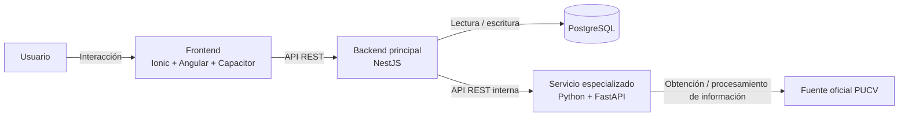

# Diagrama de contenedores/componentes — LISTOCO

Este diagrama representa los principales componentes tecnológicos de LISTOCO y la forma en que se comunican entre sí.

## Descripción de componentes

### Frontend — Ionic + Angular + Capacitor

Es la interfaz con la que interactúa el estudiante o administrador.

Será responsable de:

- mostrar las distintas vistas del sistema;
- gestionar la navegación;
- mostrar formularios;
- enviar solicitudes al backend;
- visualizar respuestas y resultados.

El frontend se comunicará exclusivamente con NestJS.

### Backend principal — NestJS

Será el punto central de acceso al sistema.

Será responsable de:

- exponer la API REST;
- implementar la lógica principal del negocio;
- gestionar autenticación y autorización;
- validar datos;
- acceder a PostgreSQL;
- comunicarse con FastAPI;
- centralizar errores y respuestas.

### PostgreSQL

Será la base de datos principal de LISTOCO.

Almacenará información relacionada con:

- usuarios;
- estudiantes;
- asignaturas;
- secciones;
- inscripciones;
- preferencias;
- solicitudes y otros datos académicos.

### Servicio Python — FastAPI

Será el servicio especializado de LISTOCO.

Inicialmente tendrá endpoints básicos y posteriormente podrá encargarse de:

- procesamiento de información obtenida desde la Web;
- generación de horarios;
- recomendaciones;
- procesamiento asociado a la capacidad adaptativa.

### Fuente oficial PUCV

Corresponde a la fuente web externa desde donde LISTOCO obtendrá información curricular.

Inicialmente se utilizará la malla oficial de Ingeniería Civil Informática de la PUCV.