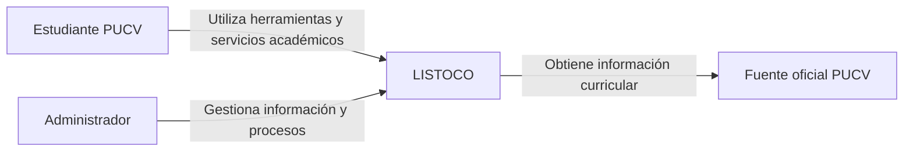

# Diagrama de contexto — LISTOCO

El siguiente diagrama representa los actores principales que interactúan con LISTOCO y las fuentes externas consideradas inicialmente.

## Descripción

- **Estudiante PUCV:** usuario principal de LISTOCO. Utiliza la plataforma para apoyar su planificación y distintas actividades de su vida académica.
- **Administrador:** gestiona información y procesos necesarios para el funcionamiento de LISTOCO.
- **LISTOCO:** plataforma central que proporciona las funcionalidades académicas al estudiante.
- **Fuente oficial PUCV:** fuente externa utilizada inicialmente para obtener información curricular, comenzando por la malla oficial de Ingeniería Civil Informática.