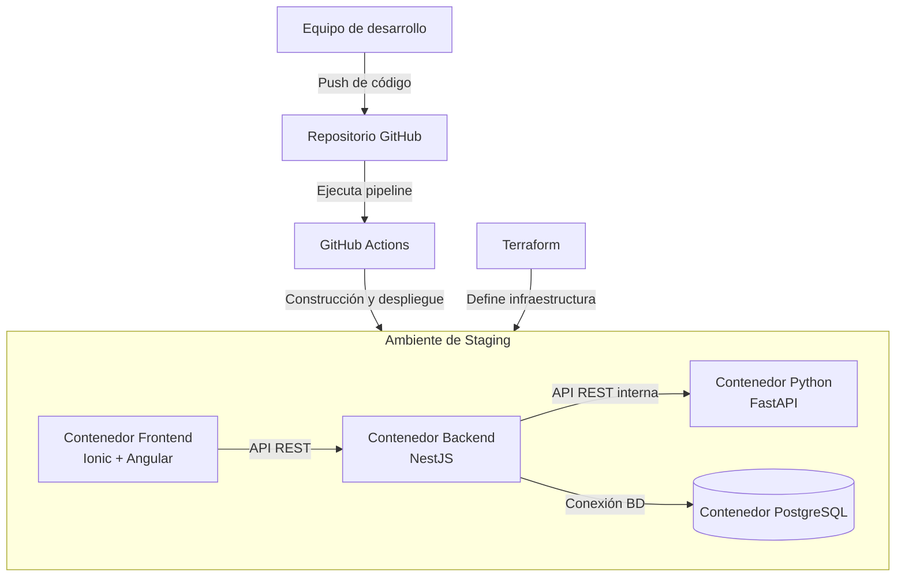

# Diagrama de despliegue preliminar — LISTOCO

Este diagrama representa la estrategia preliminar de despliegue de LISTOCO para la Entrega Parcial 1.



## Descripción

LISTOCO estará compuesto por servicios independientes contenerizados mediante Docker.

Los principales componentes desplegados serán:

- frontend Ionic + Angular;
- backend NestJS;
- servicio Python con FastAPI;
- base de datos PostgreSQL.

Durante el desarrollo local, los servicios serán coordinados mediante Docker Compose.

El código fuente se mantendrá en GitHub y GitHub Actions ejecutará el pipeline DevSecOps encargado de validar, construir y posteriormente desplegar la aplicación.

Terraform se utilizará para definir de manera reproducible la infraestructura necesaria para el ambiente de staging.

## Comunicación entre servicios

El flujo desplegado será:

```text
Usuario
   ↓
Frontend
   ↓
NestJS
  ↙    ↘
PostgreSQL  FastAPI
```

NestJS actuará como backend principal y será el único servicio backend consumido directamente por el frontend.

## Estado

Este diseño corresponde a una propuesta preliminar para la EP1 y podrá evolucionar durante las siguientes etapas del proyecto.