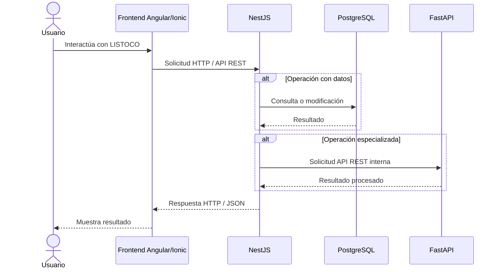

# Flujo entre componentes — LISTOCO

Este documento describe cómo se comunicarán los principales componentes de LISTOCO.

## Flujo general



## Descripción del flujo

### 1. Usuario → Frontend

El estudiante o administrador interactúa con la interfaz desarrollada mediante Ionic y Angular.

Desde el frontend se podrán realizar acciones como:

- iniciar sesión;
- consultar información académica;
- gestionar asignaturas;
- revisar solicitudes;
- registrar eventos;
- utilizar funcionalidades de planificación.

---

### 2. Frontend → NestJS

El frontend enviará las solicitudes al backend principal mediante una API REST.

NestJS será el único punto de acceso directo desde el frontend hacia los servicios backend.

El frontend no se comunicará directamente con PostgreSQL ni con FastAPI.

---

### 3. NestJS → PostgreSQL

Cuando una operación requiera acceder a información persistente, NestJS se comunicará con PostgreSQL.

Ejemplos:

- consultar usuarios;
- obtener información de asignaturas;
- revisar inscripciones;
- guardar preferencias;
- registrar solicitudes académicas;
- consultar eventos del calendario.

NestJS será responsable de validar la información antes de almacenarla o utilizarla.

---

### 4. NestJS → FastAPI

Cuando una operación requiera procesamiento especializado, NestJS enviará una solicitud al servicio Python desarrollado con FastAPI.

Ejemplos futuros:

- procesamiento de información obtenida desde la Web;
- generación de alternativas de horario;
- recomendaciones;
- evaluación de preferencias del estudiante.

FastAPI procesará la solicitud y devolverá una respuesta estructurada a NestJS.

---

### 5. NestJS → Frontend

NestJS recibirá los resultados provenientes de PostgreSQL o FastAPI y generará la respuesta final para el frontend.

La respuesta será enviada en formato JSON utilizando códigos HTTP apropiados.

---

## Ejemplo de flujo

Un futuro proceso de generación de horario podría seguir este flujo:

```text
Estudiante
   ↓
Frontend Angular/Ionic
   ↓
NestJS
   ↓
PostgreSQL
   ↓
Obtiene ramos, preferencias y datos académicos
   ↓
NestJS
   ↓
FastAPI
   ↓
Procesa alternativas
   ↓
NestJS
   ↓
Frontend
   ↓
Estudiante visualiza horarios propuestos
```

## Principio arquitectónico

NestJS actuará como backend principal y coordinador del sistema.

El flujo esperado será:

```text
Frontend → NestJS → FastAPI
            ↓
        PostgreSQL
```

El frontend no accederá directamente al servicio Python ni a la base de datos.