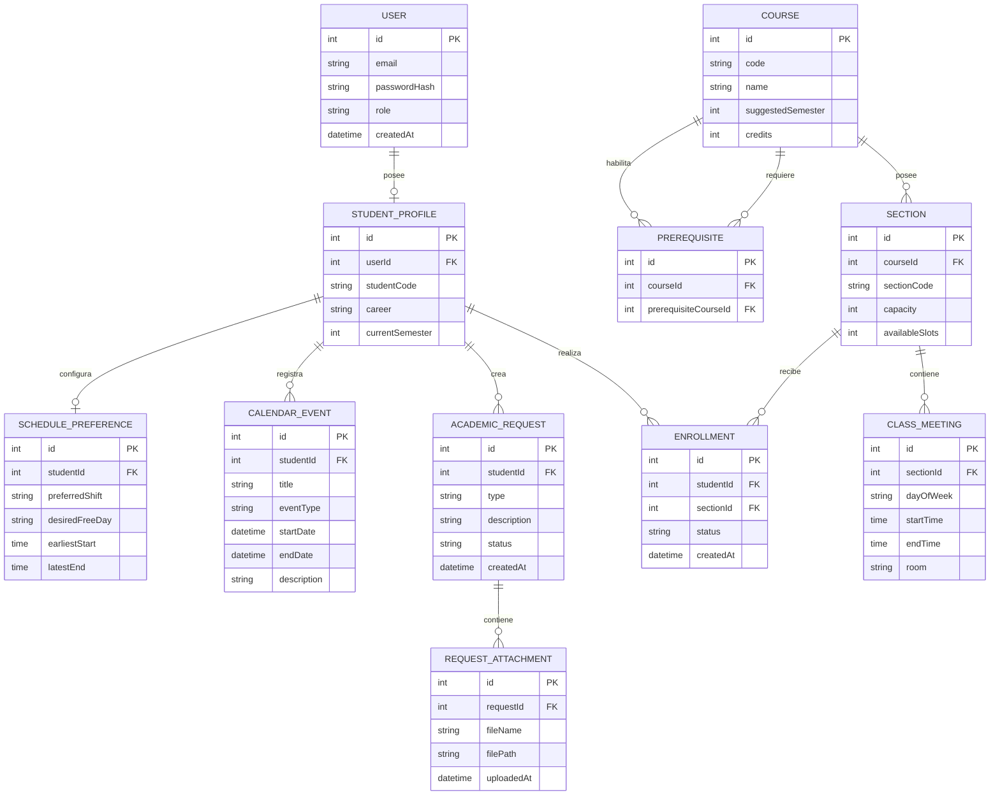

# Modelo inicial de base de datos — LISTOCO

El siguiente modelo representa las principales entidades necesarias para la primera versión de LISTOCO.

El modelo es preliminar y podrá evolucionar a medida que se incorporen nuevas funcionalidades.



## Descripción de entidades

### USER

Representa las cuentas que pueden acceder a LISTOCO.

Inicialmente se consideran dos roles:

- estudiante;
- administrador.

La contraseña no se almacenará directamente, sino mediante un hash seguro.

---

### STUDENT_PROFILE

Contiene información académica específica del estudiante.

Se mantiene separada de `USER` para diferenciar los datos de autenticación de los datos académicos.

---

### COURSE

Representa una asignatura de la carrera.

Permitirá almacenar inicialmente:

- código;
- nombre;
- semestre sugerido;
- créditos.

La información correspondiente a la estructura curricular tendrá como referencia inicial la malla oficial de Ingeniería Civil Informática de la PUCV.

---

### PREREQUISITE

Representa la relación de prerrequisito entre dos asignaturas.

Por ejemplo:

```text
Programación 1
      ↓
Programación 2
```

Una asignatura puede requerir una o más asignaturas previamente aprobadas.

---

### SECTION

Representa una sección disponible de una asignatura.

Contiene información relacionada con:

- asignatura;
- código o número de sección;
- capacidad;
- cupos disponibles.

---

### CLASS_MEETING

Representa un bloque horario asociado a una sección.

Se utiliza una entidad separada debido a que una misma sección puede tener más de una clase durante la semana.

Ejemplo:

```text
Base de Datos - Sección 1

Lunes     09:30 - 11:00
Miércoles 09:30 - 11:00
```

---

### ENROLLMENT

Representa la relación entre un estudiante y una sección.

El estado podrá representar situaciones como:

- inscrito;
- pendiente;
- lista de espera;
- desinscrito.

---

### SCHEDULE_PREFERENCE

Almacena preferencias utilizadas posteriormente por la capacidad adaptativa de LISTOCO.

Por ejemplo:

- jornada preferida;
- día libre deseado;
- hora más temprana aceptable;
- hora máxima de término.

Estas preferencias podrán utilizarse posteriormente para generar y priorizar horarios.

---

### ACADEMIC_REQUEST

Representa una solicitud académica realizada por el estudiante.

Permitirá posteriormente manejar trámites como:

- justificación de inasistencia;
- solicitud de sobrecupo;
- problema de inscripción;
- otras solicitudes académicas.

Los posibles estados podrán ser:

```text
Pendiente
En revisión
Aceptada
Rechazada
```

---

### REQUEST_ATTACHMENT

Representa documentos adjuntos a una solicitud académica.

Por ejemplo, una justificación de inasistencia podrá incluir un certificado u otro documento de respaldo.

---

### CALENDAR_EVENT

Permite al estudiante registrar eventos académicos o personales relacionados con su organización universitaria.

Ejemplos:

- prueba;
- certamen;
- entrega;
- presentación;
- recordatorio personal.

---

## Relaciones principales

El modelo permite representar inicialmente el siguiente flujo:

```text
Usuario
  ↓
Perfil estudiante
  ├── Inscripciones
  ├── Preferencias de horario
  ├── Solicitudes académicas
  └── Calendario

Asignatura
  ├── Prerrequisitos
  └── Secciones
        └── Bloques horarios
```

Este modelo constituye una propuesta inicial para la Entrega Parcial 1 y podrá ampliarse en futuras etapas del proyecto.